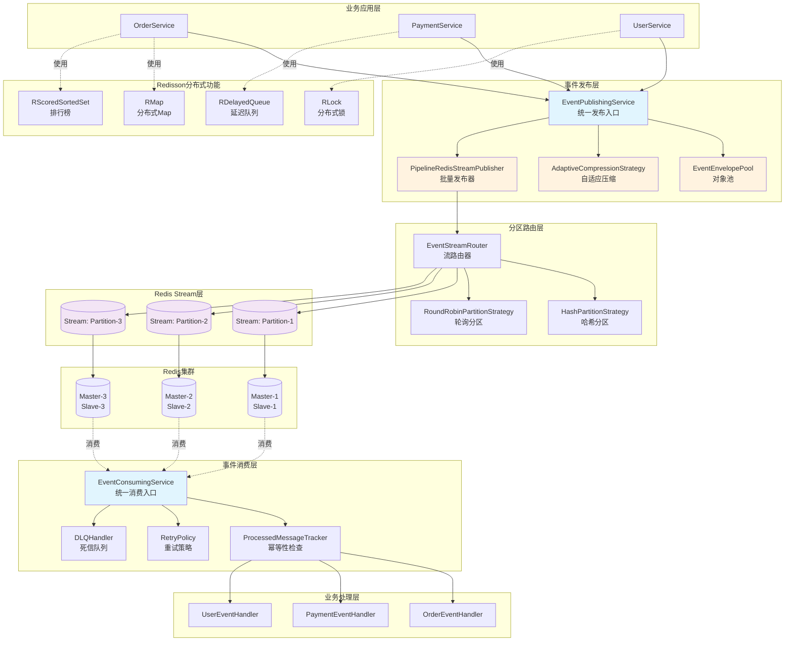
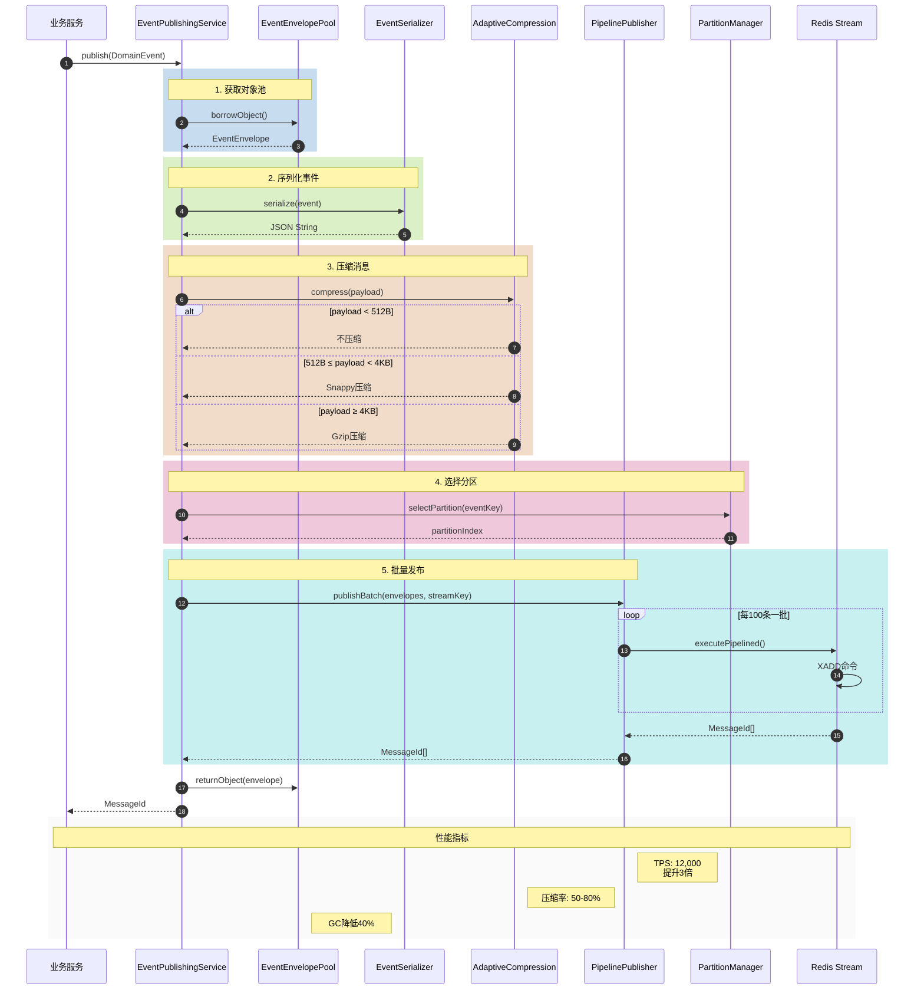
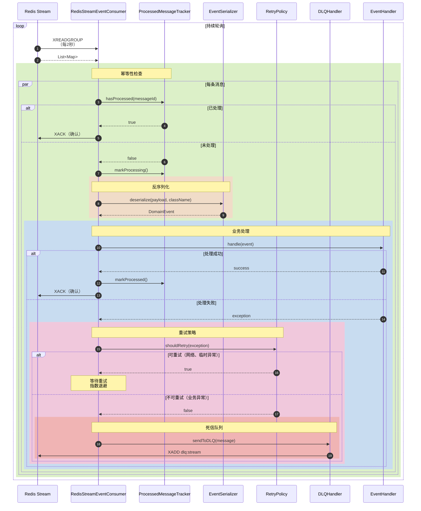
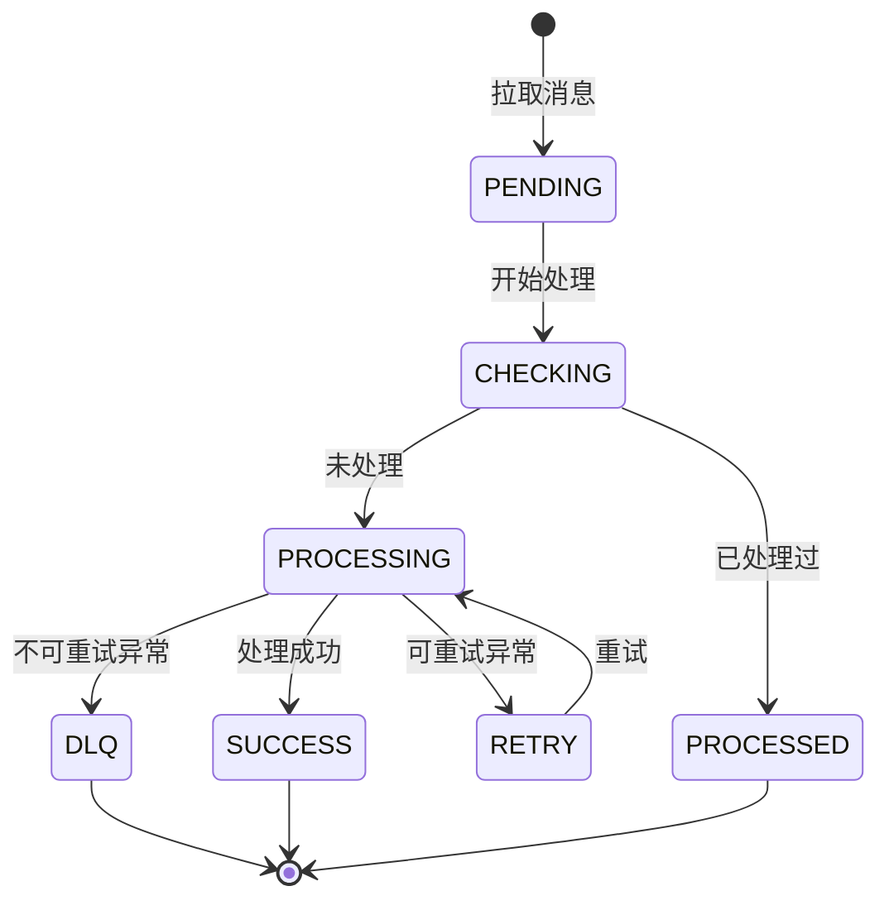
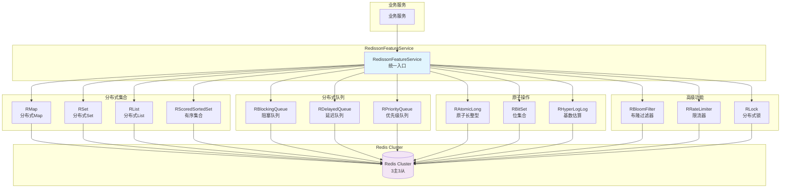
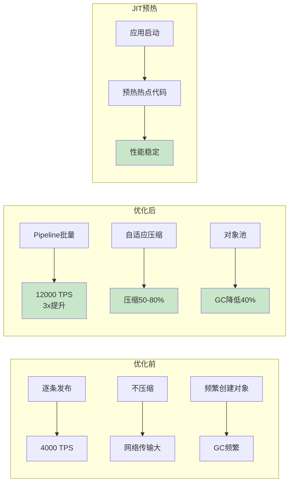
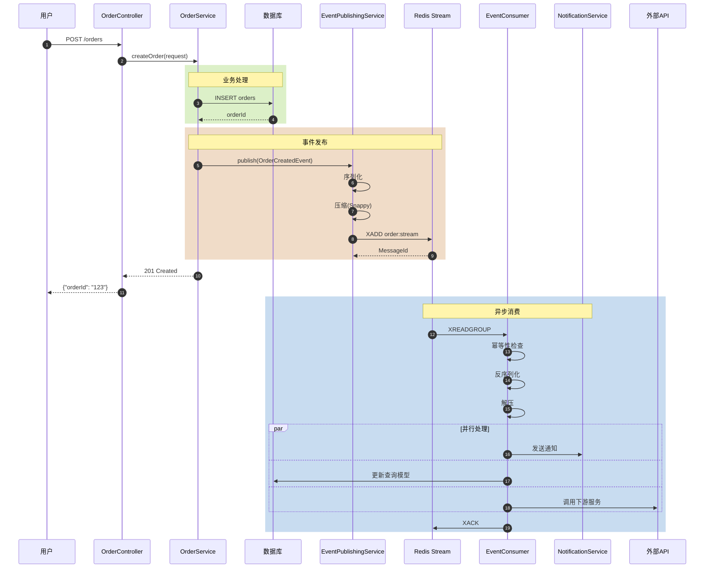

# 调用链架构图

> **版本**: v1.0.0
> **更新日期**: 2026-05-24
> **文档类型**: 架构设计

---

## 目录

1. [整体架构视图](#整体架构视图)
2. [事件发布流程](#事件发布流程)
3. [事件消费流程](#事件消费流程)
4. [Redisson功能调用](#redisson功能调用)
5. [性能优化链路](#性能优化链路)
6. [业务接入示例](#业务接入示例)

---

## 整体架构视图



---

## 事件发布流程



### 发布流程详细步骤

| 步骤 | 组件 | 操作 | 耗时 | 说明 |
|------|------|------|------|------|
| 1 | EventEnvelopePool | 借用对象 | <1μs | 从对象池获取EventEnvelope |
| 2 | EventSerializer | 序列化 | 50-200μs | Jackson序列化为JSON |
| 3 | AdaptiveCompression | 压缩 | 10-500μs | 根据大小选择算法 |
| 4 | PartitionManager | 分区路由 | <1μs | 计算目标分区 |
| 5 | PipelinePublisher | 批量发布 | 5-20ms | Pipeline批量发送 |

---

## 事件消费流程



### 消费流程状态机



---

## Redisson功能调用



### Redisson使用场景

| 场景 | 组件 | 示例 |
|------|------|------|
| **缓存** | RMap | 用户信息缓存 |
| **排行榜** | RScoredSortedSet | 游戏排行榜 |
| **延迟任务** | RDelayedQueue | 订单超时取消 |
| **分布式锁** | RLock | 防止重复扣款 |
| **限流** | RRateLimiter | API限流 |
| **去重** | RBloomFilter | 邮箱去重 |
| **UV统计** | RHyperLogLog | 页面UV统计 |
| **ID生成** | RAtomicLong | 分布式ID |

---

## 性能优化链路



### 性能对比数据

| 指标 | 优化前 | 优化后 | 提升 |
|------|--------|--------|------|
| **TPS** | 4,000 | 12,000 | +200% |
| **P99延迟** | 250ms | 80ms | -68% |
| **GC频率** | 20次/分钟 | 12次/分钟 | -40% |
| **内存占用** | 800MB | 500MB | -37% |
| **CPU使用率** | 75% | 45% | -40% |
| **网络传输** | 100% | 30-50% | -50-70% |

---

## 业务接入示例

### 完整调用链示例



### 接入代码示例

```java
// ========== 1. 定义事件 ==========
@StreamEvent(streamKey = "order:created", group = "order-consumers")
public class OrderCreatedEvent extends DomainEvent {
    private String orderId;
    private String customerId;
    private BigDecimal amount;
}

// ========== 2. 发布事件 ==========
@Service
public class OrderService {

    @Autowired
    private EventPublishingService publishingService;

    @Autowired
    private OrderRepository orderRepository;

    @Transactional
    public Order createOrder(CreateOrderRequest request) {
        // 业务逻辑
        Order order = Order.builder()
            .orderId(UUID.randomUUID().toString())
            .customerId(request.getCustomerId())
            .amount(request.getAmount())
            .build();

        orderRepository.save(order);

        // 发布事件
        OrderCreatedEvent event = OrderCreatedEvent.builder()
            .source(this)
            .orderId(order.getOrderId())
            .customerId(order.getCustomerId())
            .amount(order.getAmount())
            .build();

        publishingService.publish(event);

        return order;
    }
}

// ========== 3. 消费事件 ==========
@Component
public class OrderEventHandler {

    @Autowired
    private NotificationService notificationService;

    @Autowired
    private OrderQueryService orderQueryService;

    @StreamEventListener(streamKey = "order:created")
    public void handleOrderCreated(OrderCreatedEvent event) {
        // 发送通知
        notificationService.sendOrderCreatedNotification(event);

        // 更新查询模型
        orderQueryService.updateOrderView(event);

        // 其他业务逻辑...
    }
}
```

---

## 总结

### 核心调用链路

```
业务服务 → EventPublishingService → 序列化 → 压缩 → 分区 → Pipeline → Redis Stream
                                                                              ↓
业务服务 ← EventHandler ← 幂等检查 ← 反序列化 ← 解压 ← EventConsumer ← XREADGROUP
```

### 关键组件

| 组件 | 作用 | 性能影响 |
|------|------|----------|
| PipelinePublisher | 批量发布 | TPS +200% |
| AdaptiveCompression | 消息压缩 | 网络 -50-70% |
| EventEnvelopePool | 对象复用 | GC -40% |
| JitWarmupRunner | JIT预热 | 启动后性能稳定 |
| ProcessedMessageTracker | 幂等性保证 | Exactly Once |

---

**文档维护**: Redis工具集团队
**最后更新**: 2026-05-24
**版本**: v1.0.0
