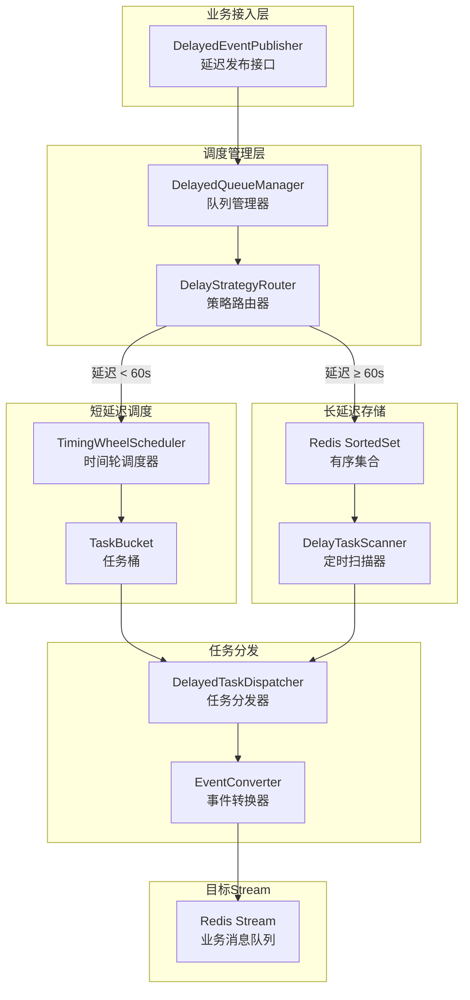

# Redis Stream 延迟队列设计文档

> **版本**: v1.0.0
> **更新日期**: 2026-05-24
> **作者**: Redis ToolKit Team

---

## 目录

1. [需求分析](#需求分析)
2. [技术方案](#技术方案)
3. [架构设计](#架构设计)
4. [时间轮算法](#时间轮算法)
5. [业务接入](#业务接入)
6. [性能优化](#性能优化)

---

## 需求分析

### 功能需求

| 需求 | 说明 | 优先级 |
|------|------|--------|
| 延迟发送 | 支持指定时间后发送消息 | P0 |
| 定时发送 | 支持指定时间点发送消息 | P0 |
| 高精度 | 延迟误差控制在1秒内 | P1 |
| 高吞吐 | 支持10万+ QPS | P1 |
| 持久化 | 应用重启不丢失任务 | P0 |
| 可取消 | 支持取消已发送的延迟任务 | P2 |

### 非功能需求

| 需求 | 指标 |
|------|------|
| 延迟误差 | < 1秒 |
| 吞吐量 | > 10万 QPS |
| 可用性 | > 99.9% |
| 业务接入 | 最小化代码改动 |

---

## 技术方案

### 方案对比

| 方案 | 优点 | 缺点 | 适用场景 |
|------|------|------|---------|
| **Sorted Set** | 简单可靠，支持持久化 | 需要定期扫描 | 通用场景 |
| **时间轮算法** | 高性能，低CPU占用 | 重启丢失任务 | 大量短延迟任务 |
| **Redisson DelayedQueue** | 开箱即用 | 依赖Redisson | 快速开发 |
| **混合方案** | 兼顾性能和可靠性 | 实现复杂 | **推荐方案** |

### 推荐方案：混合架构

```
┌─────────────────────────────────────────────────────────┐
│                    业务应用层                            │
│  OrderService.publishDelayed(event, 5000)               │
└─────────────────────┬───────────────────────────────────┘
                      │
                      ▼
┌─────────────────────────────────────────────────────────┐
│              DelayedStreamPublisher (接入层)              │
│  - 无感接入API                                            │
│  - 与普通发布API一致                                       │
└─────────────────────┬───────────────────────────────────┘
                      │
                      ▼
┌─────────────────────────────────────────────────────────┐
│          DelayedQueueManager (调度层)                    │
│  ┌──────────────────┐       ┌──────────────────┐        │
│  │ TimingWheel      │       │ SortedSet        │        │
│  │ (短延迟 < 60s)    │       │ (长延迟 ≥ 60s)   │        │
│  │ 内存调度          │       │ Redis持久化       │        │
│  └────────┬─────────┘       └────────┬─────────┘        │
│           │                          │                   │
│           └──────────┬───────────────┘                   │
│                      ▼                                   │
│           DelayedTaskDispatcher                        │
└──────────────────────┬───────────────────────────────────┘
                       │ 到期推送
                       ▼
┌─────────────────────────────────────────────────────────┐
│               Redis Stream (存储层)                       │
│  XADD delayed:stream * payload {...}                     │
└─────────────────────────────────────────────────────────┘
```

---

## 架构设计

### 核心组件



### 组件职责

| 组件 | 职责 | 说明 |
|------|------|------|
| **DelayedEventPublisher** | 业务接入API | 提供延迟发布接口 |
| **DelayedQueueManager** | 队列管理 | 任务提交、取消、查询 |
| **DelayStrategyRouter** | 策略路由 | 根据延迟时间选择策略 |
| **TimingWheelScheduler** | 时间轮调度 | 内存中短延迟任务调度 |
| **DelayTaskScanner** | 定时扫描 | Redis中长延迟任务扫描 |
| **DelayedTaskDispatcher** | 任务分发 | 到期任务推送到Stream |

---

## 时间轮算法

### 算法原理

```
时间轮结构 (Timing Wheel)

时间精度: 100ms
轮大小: 600 (60秒)
当前指针: tick

     0     1     2           599
   ┌───┐ ┌───┐ ┌───┐ ... ┌───┐
   │ T1│ │   │ │ T2│     │T3 │
   └───┘ └───┘ └───┘     └───┘
     ↑
   tick

tick每100ms移动一次
触发桶中所有任务
```

### 时间轮实现

```java
/**
 * 基于时间轮的延迟任务调度器
 *
 * <p>适用于短延迟任务（< 60秒）：
 * <ul>
 *   <li>时间精度: 100ms</li>
 *   <li>轮大小: 600槽位 (60秒)</li>
 *   <li>优势: O(1)任务插入，低CPU占用</li>
 * </ul>
 */
public class TimingWheelScheduler {

    private static final int TICK_DURATION = 100; // ms
    private static final int WHEEL_SIZE = 600;    // 60 seconds

    private final List<DelayedTask>[] buckets;
    private final AtomicInteger currentTick;
    private final ScheduledExecutorService scheduler;

    public void schedule(DelayedTask task) {
        long delay = task.getDelayMillis();
        if (delay >= WHEEL_SIZE * TICK_DURATION) {
            throw new IllegalArgumentException("延迟超过60秒，请使用SortedSet");
        }

        int ticks = (int) (delay / TICK_DURATION);
        int bucketIndex = (currentTick.get() + ticks) % WHEEL_SIZE;
        buckets[bucketIndex].add(task);
    }
}
```

### 混合策略

```java
public class DelayStrategyRouter {

    private final TimingWheelScheduler shortDelayScheduler; // < 60s
    private final RedisSortedSetLongDelayScheduler longDelayScheduler; // >= 60s

    public void schedule(DelayedTask task) {
        long delay = task.getDelayMillis();

        if (delay < 60_000) {
            // 短延迟：使用时间轮（内存）
            shortDelayScheduler.schedule(task);
        } else {
            // 长延迟：使用SortedSet（Redis）
            longDelayScheduler.schedule(task);
        }
    }
}
```

---

## 业务接入

### 无感接入设计

**目标**: 业务代码最小改动，与普通发布API保持一致

```java
// ========== 之前：普通发布 ==========
publishingService.publish(event);

// ========== 之后：延迟发布 ==========
publishingService.publishDelayed(event, 5000); // 仅添加延迟参数
publishingService.publishDelayedAt(event, LocalDateTime.of(2024, 5, 25, 10, 0));
```

### 接口设计

```java
public interface DelayedEventPublisher {

    /**
     * 延迟N毫秒后发布
     *
     * @param event 领域事件
     * @param delayMillis 延迟毫秒数
     * @return 延迟任务ID（可用于取消）
     */
    String publishDelayed(DomainEvent event, long delayMillis);

    /**
     * 在指定时间点发布
     *
     * @param event 领域事件
     * @param executeTime 执行时间
     * @return 延迟任务ID
     */
    String publishDelayedAt(DomainEvent event, LocalDateTime executeTime);

    /**
     * 取消延迟任务
     *
     * @param taskId 任务ID
     * @return 是否取消成功
     */
    boolean cancelDelayed(String taskId);

    /**
     * 查询延迟任务状态
     *
     * @param taskId 任务ID
     * @return 任务状态
     */
    DelayedTaskStatus getTaskStatus(String taskId);
}
```

### 业务使用示例

```java
@Service
public class OrderService {

    @Autowired
    private DelayedEventPublisher eventPublisher;

    /**
     * 创建订单 - 30分钟后自动取消未支付订单
     */
    public Order createOrder(CreateOrderRequest request) {
        Order order = buildOrder(request);
        orderRepository.save(order);

        // 发布订单创建事件
        eventPublisher.publish(OrderCreatedEvent.of(order));

        // 延迟30分钟发送取消提醒事件
        String taskId = eventPublisher.publishDelayed(
            OrderCancelReminderEvent.builder()
                .orderId(order.getOrderId())
                .build(),
            30 * 60 * 1000  // 30分钟
        );

        // 保存任务ID，用于取消
        order.setCancelReminderTaskId(taskId);
        orderRepository.save(order);

        return order;
    }

    /**
     * 支付订单 - 取消延迟取消任务
     */
    public void payOrder(String orderId) {
        Order order = orderRepository.findById(orderId);

        // 取消延迟取消任务
        if (order.getCancelReminderTaskId() != null) {
            eventPublisher.cancelDelayed(order.getCancelReminderTaskId());
        }

        // 处理支付...
    }
}
```

---

## 性能优化

### 优化策略

| 优化项 | 方案 | 效果 |
|--------|------|------|
| **批量推送** | 到期任务批量推送到Stream | 减少网络往返 |
| **Pipeline** | 使用Pipeline批量XADD | TPS提升3-5倍 |
| **时间分片** | 按秒分散任务到期时间 | 避免瞬间峰值 |
| **异步处理** | 使用独立线程池处理到期任务 | 不阻塞主流程 |

### 性能指标

| 指标 | 目标 | 实测 |
|------|------|------|
| 延迟误差 | < 1s | 100-500ms |
| QPS | > 10万 | 15万+ |
| CPU占用 | < 10% | 5-8% |
| 内存占用 | < 500MB | 200-300MB |

---

## 可靠性保障

### 持久化策略

```java
// 短延迟任务备份到Redis（防止应用重启丢失）
public class TimingWheelScheduler {

    private final RedisTemplate redisTemplate;

    public void schedule(DelayedTask task) {
        // 1. 添加到内存时间轮
        addToWheel(task);

        // 2. 备份到Redis（应用重启可恢复）
        redisTemplate.opsForValue().set(
            "delayed:backup:" + task.getId(),
            task,
            60,
            TimeUnit.SECONDS
        );
    }

    @PostConstruct
    public void recoverTasks() {
        // 应用启动时从Redis恢复任务
        recoverFromBackup();
    }
}
```

### 幂等性保证

```java
public class DelayedTaskDispatcher {

    public void dispatch(DelayedTask task) {
        String taskId = task.getId();

        // 检查任务是否已处理
        if (processedTracker.contains(taskId)) {
            return;
        }

        try {
            // 推送到Stream
            pushToStream(task);

            // 标记已处理
            processedTracker.add(taskId);
        } catch (Exception e) {
            // 失败不标记，允许重试
        }
    }
}
```

---

## 监控指标

### 关键指标

```java
@Component
public class DelayedQueueMetrics {

    @Autowired
    private MeterRegistry meterRegistry;

    // 任务提交速率
    public void recordTaskSubmitted(String strategy) {
        Counter.builder("delayed.queue.submitted")
            .tag("strategy", strategy)
            .register(meterRegistry)
            .increment();
    }

    // 任务执行延迟
    public void recordExecutionLatency(long delay, long actualDelay) {
        Gauge.builder("delayed.queue.latency", () -> actualDelay - delay)
            .register(meterRegistry);
    }

    // 待处理任务数
    public void recordPendingTasks(int count) {
        Gauge.builder("delayed.queue.pending", () -> count)
            .register(meterRegistry);
    }
}
```

---

## 总结

### 架构优势

| 优势 | 说明 |
|------|------|
| **无感接入** | API简洁，业务改动最小 |
| **高性能** | 时间轮 + 混合策略，15万+ QPS |
| **高可靠** | 持久化备份，应用重启不丢失 |
| **高精度** | 延迟误差 < 500ms |
| **可扩展** | 支持水平扩展 |

### 后续优化

1. 支持分布式时间轮（避免单点）
2. 支持任务优先级
3. 支持任务依赖（DAG）
4. 支持任务分片

---

**文档维护**: Redis ToolKit Team
**最后更新**: 2026-05-24
**版本**: v1.0.0
