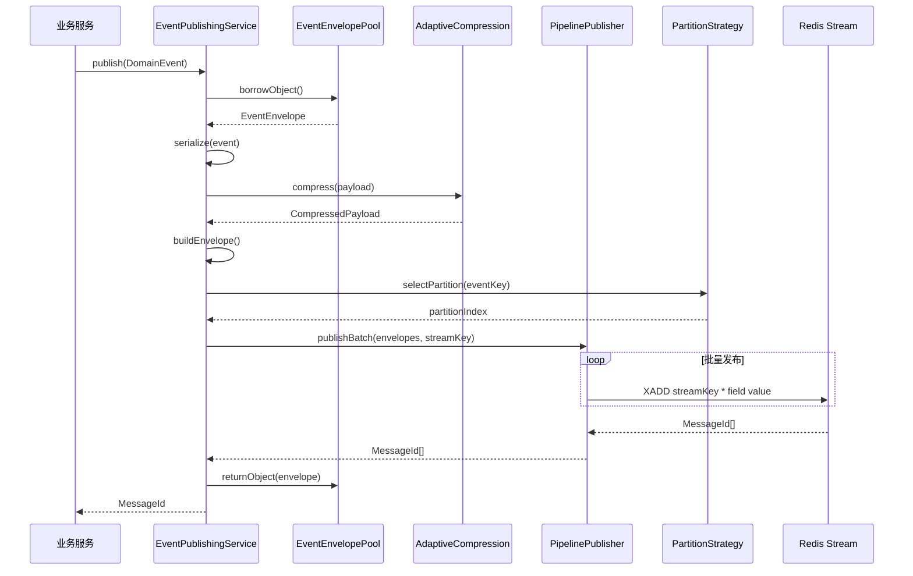
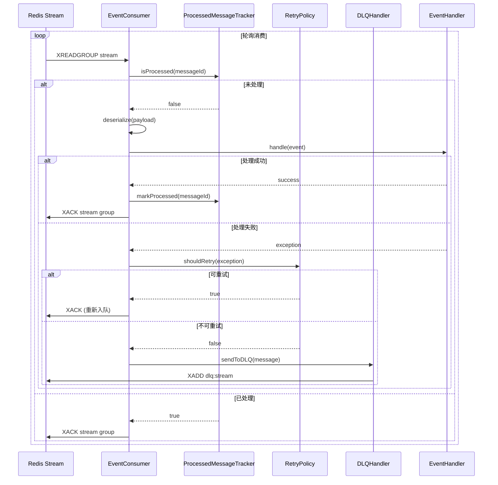
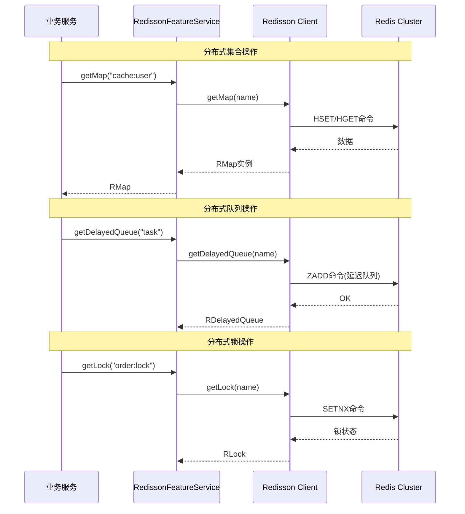
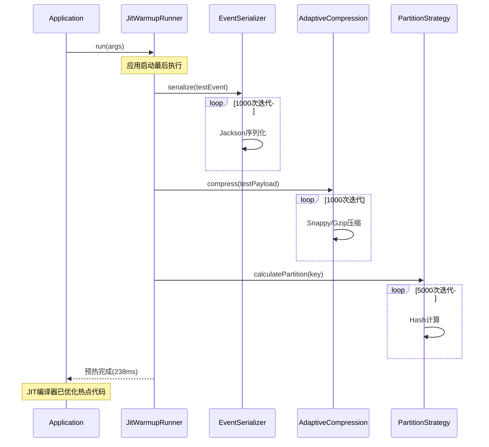

# Redis工具集业务接入指南

> **版本**: v1.0.0
> **更新日期**: 2026-05-24
> **适用对象**: 业务应用开发者、系统集成工程师

---

## 目录

1. [整体架构](#整体架构)
2. [调用链图](#调用链图)
3. [快速接入](#快速接入)
4. [核心模块使用](#核心模块使用)
5. [最佳实践](#最佳实践)

---

## 整体架构

### 系统分层架构

```
┌─────────────────────────────────────────────────────────────────┐
│                         业务应用层                                │
│  ┌─────────────┐  ┌─────────────┐  ┌─────────────┐             │
│  │ OrderService│  │PayService   │  │  UserService│             │
│  └──────┬──────┘  └──────┬──────┘  └──────┬──────┘             │
└─────────┼──────────────────┼──────────────────┼────────────────┘
          │                  │                  │
          │ EventPublish     │ EventPublish     │ EventPublish
          ▼                  ▼                  ▼
┌─────────────────────────────────────────────────────────────────┐
│                         事件发布层                                │
│  ┌─────────────────────────────────────────────────────────┐    │
│  │         EventPublishingService (统一发布入口)             │    │
│  └───────────────────────────┬─────────────────────────────┘    │
└──────────────────────────────┼──────────────────────────────────┘
                               │
          ┌────────────────────┼────────────────────┐
          │                    │                    │
          ▼                    ▼                    ▼
┌─────────────────┐  ┌─────────────────┐  ┌─────────────────┐
│ PipelinePublisher│  │  SnappyCompress │  │  ObjectPool     │
│  (批量发布)      │  │   (消息压缩)     │  │  (对象复用)      │
└────────┬────────┘  └────────┬────────┘  └────────┬────────┘
         │                    │                    │
         └────────────────────┼────────────────────┘
                              ▼
┌─────────────────────────────────────────────────────────────────┐
│                         Redis Stream层                           │
│  ┌─────────────┐  ┌─────────────┐  ┌─────────────┐             │
│  │ Stream:1    │  │ Stream:2    │  │ Stream:3    │             │
│  │ (分区1)     │  │ (分区2)     │  │ (分区3)     │             │
│  └──────┬──────┘  └──────┬──────┘  └──────┬──────┘             │
└─────────┼──────────────────┼──────────────────┼────────────────┘
          │                  │                  │
          ▼                  ▼                  ▼
┌─────────────────────────────────────────────────────────────────┐
│                       Redis Cluster                              │
│   Master:1     Master:2     Master:3                            │
│   Slave:1      Slave:2      Slave:3                              │
└─────────────────────────────────────────────────────────────────┘

                              ▲
                              │ 消费
                              │
┌─────────────────────────────────────────────────────────────────┐
│                         事件消费层                                │
│  ┌─────────────────────────────────────────────────────────┐    │
│  │       EventConsumingService (统一消费入口)                │    │
│  └───────────────────────────┬─────────────────────────────┘    │
└──────────────────────────────┼──────────────────────────────────┘
                               │
          ┌────────────────────┼────────────────────┐
          ▼                    ▼                    ▼
┌─────────────────┐  ┌─────────────────┐  ┌─────────────────┐
│ IdempotentCheck │  │   RetryPolicy   │  │   DLQHandler    │
│  (幂等性检查)    │  │   (重试策略)     │  │  (死信队列)     │
└────────┬────────┘  └────────┬────────┘  └────────┬────────┘
         │                    │                    │
         └────────────────────┼────────────────────┘
                              ▼
┌─────────────────────────────────────────────────────────────────┐
│                       业务事件处理器                              │
│  ┌─────────────┐  ┌─────────────┐  ┌─────────────┐             │
│  │OrderHandler │  │ PayHandler  │  │ UserHandler  │             │
│  └─────────────┘  └─────────────┘  └─────────────┘             │
└─────────────────────────────────────────────────────────────────┘
```

---

## 调用链图

### 1. 事件发布调用链



### 2. 事件消费调用链



### 3. Redisson分布式功能调用链



### 4. JIT预热调用链



---

## 快速接入

### 步骤1: 添加依赖

```xml
<!-- 在业务应用的 pom.xml 中添加 -->
<dependency>
    <groupId>io.github.dekkerding</groupId>
    <artifactId>redis-toolkit-stream</artifactId>
    <version>1.0.0</version>
</dependency>

<!-- 依赖传递包含 -->
<!-- spring-boot-starter-data-redis -->
<!-- redisson-spring-boot-starter -->
<!-- commons-pool2 -->
<!-- snappy-java -->
```

### 步骤2: 配置Redis连接

```yaml
# application.yml
spring:
  redis:
    cluster:
      nodes:
        - 192.168.10.107:6379
        - 192.168.10.107:6380
        - 192.168.10.107:6381
        - 192.168.10.109:6379
        - 192.168.10.109:6380
        - 192.168.10.109:6381
      password: ${REDIS_PASSWORD}
    lettuce:
      pool:
        max-active: 50
        max-idle: 20
        min-idle: 5

# Redis工具集配置
redis-toolkit:
  stream:
    event:
      enabled: true
      key-prefix: "myapp:stream:"
      partition:
        enabled: true
        count: 3
        strategy: hash  # hash 或 round-robin
      idempotent:
        enabled: true
        key-ttl: 86400
      retry:
        max-attempts: 3
        initial-interval: 1000
```

### 步骤3: 启用组件扫描

```java
@SpringBootApplication
@ComponentScan(basePackages = {
    "io.github.dekkerding.examples",  // 工具集包
    "com.mycompany.myapp"              // 业务应用包
})
public class MyApplication {
    public static void main(String[] args) {
        SpringApplication.run(MyApplication.class, args);
    }
}
```

### 步骤4: 创建业务事件

```java
package com.mycompany.myapp.domain.event;

import io.github.dekkerding.examples.domain.event.DomainEvent;
import io.github.dekkerding.examples.infrastructure.annotation.StreamEvent;
import lombok.Builder;
import lombok.Data;
import lombok.EqualsAndHashCode;

@Data
@EqualsAndHashCode(callSuper = true)
@StreamEvent(streamKey = "order:created", group = "order-consumers")
public class OrderCreatedEvent extends DomainEvent {

    private String orderId;
    private String customerId;
    private BigDecimal amount;
    private String status;

    @Builder
    public OrderCreatedEvent(Object source, String orderId,
                            String customerId, BigDecimal amount, String status) {
        super(source);
        this.orderId = orderId;
        this.customerId = customerId;
        this.amount = amount;
        this.status = status;
    }
}
```

---

## 核心模块使用

### 1. 事件发布

#### 1.1 基础发布

```java
@Service
public class OrderService {

    @Autowired
    private EventPublishingService publishingService;

    public void createOrder(CreateOrderRequest request) {
        // 1. 业务逻辑
        Order order = Order.builder()
            .orderId(UUID.randomUUID().toString())
            .customerId(request.getCustomerId())
            .amount(request.getAmount())
            .build();

        orderRepository.save(order);

        // 2. 发布事件
        OrderCreatedEvent event = OrderCreatedEvent.builder()
            .source(this)
            .orderId(order.getOrderId())
            .customerId(order.getCustomerId())
            .amount(order.getAmount())
            .status("CREATED")
            .build();

        MessageId messageId = publishingService.publish(event);
        log.info("订单创建事件已发布: orderId={}, messageId={}",
                order.getOrderId(), messageId);
    }
}
```

#### 1.2 批量发布（高性能）

```java
@Service
public class BatchOrderService {

    @Autowired
    private PipelineRedisStreamPublisher pipelinePublisher;

    public void batchCreateOrders(List<CreateOrderRequest> requests) {
        // 1. 创建订单
        List<Order> orders = orders.stream()
            .map(req -> buildOrder(req))
            .collect(Collectors.toList());

        orderRepository.saveAll(orders);

        // 2. 批量发布事件
        List<EventEnvelope> envelopes = orders.stream()
            .map(order -> OrderCreatedEvent.builder()
                .source(this)
                .orderId(order.getOrderId())
                .customerId(order.getCustomerId())
                .amount(order.getAmount())
                .status("CREATED")
                .build())
            .map(event -> toEnvelope(event))
            .collect(Collectors.toList());

        // Pipeline批量发布，TPS提升3-5倍
        List<MessageId> messageIds = pipelinePublisher.publishBatch(
            envelopes,
            "order:created"
        );

        log.info("批量发布完成: count={}, messageIds={}",
                messageIds.size(), messageIds);
    }

    private EventEnvelope toEnvelope(DomainEvent event) {
        String payload = eventSerializer.serialize(event);
        AdaptiveCompressionStrategy.CompressedPayload compressed =
            compressionStrategy.compress(payload);

        return EventEnvelope.builder()
            .eventId(UUID.randomUUID().toString())
            .eventType(event.getEventType())
            .payload(new String(compressed.getData(), StandardCharsets.UTF_8))
            .metadata(EventMetadata.create(event.getClass()))
            .build();
    }
}
```

### 2. 事件消费

#### 2.1 注解式监听器

```java
@Component
@Slf4j
public class OrderEventHandler {

    @Autowired
    private OrderQueryService orderQueryService;

    @Autowired
    private NotificationService notificationService;

    @StreamEventListener(streamKey = "order:created")
    public void handleOrderCreated(OrderCreatedEvent event) {
        log.info("收到订单创建事件: orderId={}", event.getOrderId());

        try {
            // 1. 更新查询模型
            orderQueryService.updateOrderView(event);

            // 2. 发送通知
            notificationService.sendOrderCreatedNotification(event);

            log.info("订单事件处理成功: orderId={}", event.getOrderId());

        } catch (Exception e) {
            log.error("订单事件处理失败: orderId={}", event.getOrderId(), e);
            throw e; // 抛出异常触发重试
        }
    }

    @StreamEventListener(streamKey = "order:created", consumer = "analytics-consumer")
    public void handleOrderCreatedForAnalytics(OrderCreatedEvent event) {
        // 另一个消费者组，用于数据分析
        analyticsService.trackOrderCreated(event);
    }
}
```

#### 2.2 编程式消费

```java
@Service
@Slf4j
public class OrderEventConsumer {

    @Autowired
    private EventConsumingService consumingService;

    @PostConstruct
    public void init() {
        consumingService.registerConsumer(
            "order:created",
            "order-consumers",
            "analytics-consumer",
            this::processOrderEvent
        );
    }

    private void processOrderEvent(OrderCreatedEvent event) {
        // 处理事件逻辑
    }
}
```

### 3. Redisson分布式功能

#### 3.1 分布式缓存

```java
@Service
public class UserCacheService {

    @Autowired
    private RedissonFeatureService redissonService;

    public User getUserWithCache(String userId) {
        RMap<String, User> userCache = redissonService.getMap("user:cache");

        // 尝试从缓存获取
        User cached = userCache.get(userId);
        if (cached != null) {
            return cached;
        }

        // 缓存未命中，从数据库加载
        User user = userRepository.findById(userId);
        if (user != null) {
            userCache.put(userId, user); // 写入缓存
        }

        return user;
    }
}
```

#### 3.2 分布式排行榜

```java
@Service
public class LeaderboardService {

    @Autowired
    private RedissonFeatureService redissonService;

    public void updateScore(String player, int score) {
        RScoredSortedSet<String> leaderboard =
            redissonService.getScoredSet("game:leaderboard");

        leaderboard.add(score, player);
    }

    public List<String> getTopPlayers(int limit) {
        RScoredSortedSet<String> leaderboard =
            redissonService.getScoredSet("game:leaderboard");

        return leaderboard.valueRangeReversed(0, limit - 1)
            .stream()
            .collect(Collectors.toList());
    }

    public Integer getPlayerRank(String player) {
        RScoredSortedSet<String> leaderboard =
            redissonService.getScoredSet("game:leaderboard");

        return leaderboard.rank(player);
    }
}
```

#### 3.3 延迟队列

```java
@Service
public class DelayedTaskService {

    @Autowired
    private RedissonFeatureService redissonService;

    @PostConstruct
    public void init() {
        // 启动延迟任务消费者
        startConsumer();
    }

    public void scheduleDelayedOrderTimeout(String orderId, long delayMinutes) {
        RDelayedQueue<String> delayedQueue =
            redissonService.getDelayedQueue("order:timeout");

        delayedQueue.offer(orderId, delayMinutes, TimeUnit.MINUTES);
        log.info("订单超时任务已调度: orderId={}, delayMinutes={}",
                orderId, delayMinutes);
    }

    private void startConsumer() {
        RBlockingQueue<String> queue =
            redissonService.getBlockingQueue("order:timeout");

        new Thread(() -> {
            while (true) {
                try {
                    String orderId = queue.poll(5, TimeUnit.SECONDS);
                    if (orderId != null) {
                        handleOrderTimeout(orderId);
                    }
                } catch (InterruptedException e) {
                    Thread.currentThread().interrupt();
                    break;
                }
            }
        }).start();
    }

    private void handleOrderTimeout(String orderId) {
        log.info("处理订单超时: orderId={}", orderId);
        // 取消订单逻辑
    }
}
```

#### 3.4 分布式锁

```java
@Service
public class OrderPaymentService {

    @Autowired
    private RedissonFeatureService redissonService;

    public void processPayment(String orderId) {
        RLock lock = redissonService.getLock("order:payment:" + orderId);

        try {
            // 尝试获取锁，最多等待10秒，锁持有时间30秒
            boolean acquired = lock.tryLock(10, 30, TimeUnit.SECONDS);

            if (acquired) {
                try {
                    // 执行支付逻辑
                    doPayment(orderId);
                } finally {
                    lock.unlock();
                }
            } else {
                throw new BusinessException("订单正在处理中，请勿重复操作");
            }
        } catch (InterruptedException e) {
            Thread.currentThread().interrupt();
            throw new BusinessException("支付处理被中断");
        }
    }
}
```

#### 3.5 分布式ID生成

```java
@Service
public class IdGeneratorService {

    @Autowired
    private RedissonFeatureService redissonService;

    public String generateOrderId() {
        long id = redissonService.generateId("order");
        return String.format("ORD%020d", id);
    }

    public String generatePaymentId() {
        long id = redissonService.generateId("payment");
        return String.format("PAY%020d", id);
    }
}
```

### 4. 幂等性保证

```java
@Service
public class IdempotentOrderService {

    @Autowired
    private ProcessedMessageTracker messageTracker;

    @Autowired
    private OrderService orderService;

    @StreamEventListener(streamKey = "order:created")
    public void handleOrderCreated(OrderCreatedEvent event) {
        // 获取消息唯一标识
        String messageId = event.getMetadata().getEventId();

        // 检查是否已处理
        if (messageTracker.hasProcessed(messageId)) {
            log.info("消息已处理，跳过: messageId={}", messageId);
            return;
        }

        // 标记处理中（防止并发重复处理）
        if (!messageTracker.markProcessing(messageId)) {
            log.info("消息正在处理中，跳过: messageId={}", messageId);
            return;
        }

        try {
            // 处理业务逻辑
            orderService.processOrder(event);

            // 标记处理完成
            messageTracker.markProcessed(messageId);

        } catch (Exception e) {
            // 标记处理失败，允许重试
            messageTracker.markFailed(messageId);
            throw e;
        }
    }
}
```

---

## 最佳实践

### 1. 事件设计原则

| 原则 | 说明 | 示例 |
|------|------|------|
| **不可变性** | 事件创建后不应修改 | 使用 `@Builder` + final 字段 |
| **自包含** | 事件包含所有必要信息 | 包含完整订单数据，不只是ID |
| **业务语言** | 使用业务术语命名 | `OrderCreatedEvent` 而非 `OrderInsertEvent` |
| **版本管理** | 支持事件演进 | 添加 `@Version` 注解 |

### 2. 性能优化建议

```java
// ✅ 推荐：使用批量发布
List<MessageId> ids = pipelinePublisher.publishBatch(envelopes, streamKey);

// ❌ 避免：循环逐条发布
for (EventEnvelope envelope : envelopes) {
    publisher.publish(envelope); // 性能差
}
```

```java
// ✅ 推荐：使用对象池
envelopePool.borrowAndUse(envelope -> {
    // 使用对象
    return processEnvelope(envelope);
});

// ❌ 避免：频繁创建新对象
EventEnvelope envelope = new EventEnvelope(); // 增加GC压力
```

### 3. 错误处理策略

```java
@StreamEventListener(streamKey = "order:created")
public void handleOrderCreated(OrderCreatedEvent event) {
    try {
        // 业务逻辑
        processOrder(event);

    } catch (BusinessException e) {
        // 业务异常：记录日志，不重试
        log.error("业务异常，不重试: {}", e.getMessage());
        // 标记为已处理，防止重试

    } catch (TransientException e) {
        // 临时异常：抛出触发重试
        log.warn("临时异常，将重试: {}", e.getMessage());
        throw e;

    } catch (SystemException e) {
        // 系统异常：记录日志，发送告警
        log.error("系统异常，发送告警", e);
        alertService.sendAlert(e);
        throw e;
    }
}
```

### 4. 监控指标

```java
@Component
public class EventMetrics {

    @Autowired
    private MeterRegistry meterRegistry;

    public void recordEventPublished(String eventType) {
        Counter.builder("redis.events.published")
            .tag("type", eventType)
            .register(meterRegistry)
            .increment();
    }

    public void recordEventProcessed(String eventType, boolean success) {
        Counter.builder("redis.events.processed")
            .tag("type", eventType)
            .tag("status", success ? "success" : "failure")
            .register(meterRegistry)
            .increment();
    }

    public void recordProcessingTime(String eventType, long milliseconds) {
        Timer.builder("redis.events.processing.time")
            .tag("type", eventType)
            .register(meterRegistry)
            .record(milliseconds, TimeUnit.MILLISECONDS);
    }
}
```

---

## 常见问题

### Q1: 如何保证事件顺序？

**A**: 使用相同的分区键：
```java
@StreamEvent(streamKey = "order:stream", partitionKey = "orderId")
public class OrderEvent extends DomainEvent {
    // 相同orderId的事件会路由到同一分区
}
```

### Q2: 消费者如何做到 Exactly Once？

**A**: 结合幂等性检查：
```java
if (messageTracker.hasProcessed(messageId)) {
    return; // 跳过已处理消息
}
```

### Q3: 如何处理大量积压消息？

**A**: 增加消费者实例和并行度：
```yaml
redis-toolkit:
  stream:
    event:
      consumer-name: ${HOSTNAME}  # 每个实例不同消费者名
      batch-size: 50  # 增加批量大小
```

---

**文档维护**: Redis工具集团队
**版本**: v1.0.0
**最后更新**: 2026-05-24
